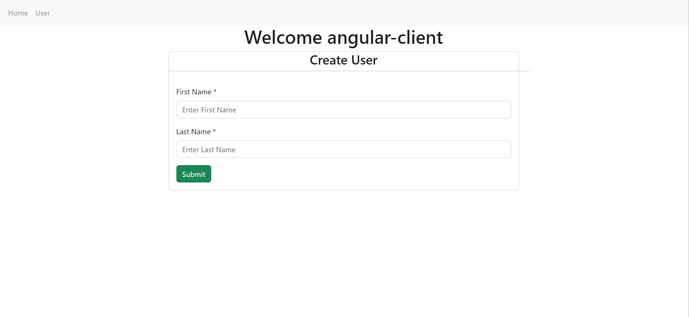
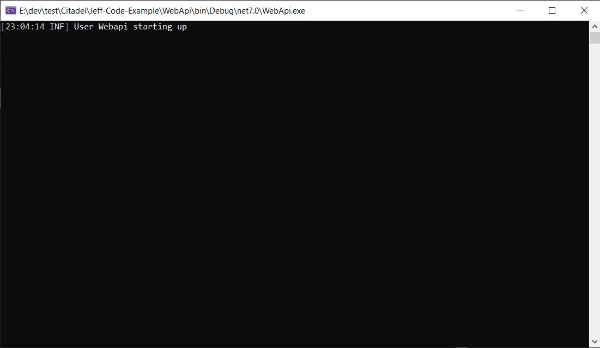

# Frontend Angular + Backend WebAPI Solution


## Tech Stack

## Backend

- [x] .NET 7
- [x] DDD
- [x] Mediator (CQRS)
- [x] Serilog
- [x] Fluent Validation
- [x] EF Core
- [x] Swagger
- [x] Health Check
- [x] Swagger
- [x] Caching
- [x] Mongodb

## Frontend

- [x] Angular 15
- [x] yarn
- [x] Ngrx
- [x] Rxjs
- [x] Ngx formly form
- [x] jest
- [x] Primeng table
- [x] Ngx-toastr
- [x] Concurrently
- [x] Json-server



1. Create a project ASP.NET Core with Angular, select Standalone TypeScript Angular Template. Give your project and solution a name. When you get to the Additional information window, be sure to check the Add integration for Empty ASP.NET Web API Project option.

2. In Solution Explorer, right-click the solution name, hover over Add, and then select New Project.

3. Search and select the ASP.NET Core Web API project.

4. In Solution Explorer, right-click the solution name and select Set Startup Project. Change the startup project from Single startup project to Multiple startup projects. Select Start for each project’s action.

   

5. Go to the launchSettings.json file in ASP.NET Core project (in the Properties folder). Get the port number from the applicationUrl property.

6. Change target. Then, go to the proxy.conf.js file for Angular project (look in the src folder). Update the target property to match the applicationUrl property in launchSettings.json.

7. Please restore angular client by **yarn install instead of npm install** if Rebuild solution fail. (only for the first time install when pull from github, please ignore this step if client is setup and restore already)

   - ./angularclient
   - $ yarn install

8. To start the project, press F5 or select the Start button at the top of the window. You will see two command prompts appear:

- The ASP.NET Core API project running



- The Angular CLI running the yarn start command


8. Monitor - Logging

- Backend: WebApi/Logs (Serilog, change setting in appsettings.json or appsettings.Development.json)

  

- Frontend: Chrome => F12 => console

  

# Backend Webapi Setup

1. Create new class library projects for backend , Domain, Application and Infrastructure

2. Add reference between projects, Infrastructure => Application => Domain, WebApi => Infrastructure

3. Open Package Manager Console
   Install-Package packagename -ProjectName projectname

4. Add following packages to Application project

```csharp
   <PackageReference Include="Ardalis.GuardClauses" Version="4.0.1" />
   <PackageReference Include="AutoMapper.Extensions.Microsoft.DependencyInjection" Version="11.0.0" />
   <PackageReference Include="FluentValidation" Version="11.4.0" />
   <PackageReference Include="FluentValidation.DependencyInjectionExtensions" Version="11.4.0" />
   <PackageReference Include="Mapster" Version="7.3.0" />
   <PackageReference Include="Mapster.DependencyInjection" Version="1.0.0" />
   <PackageReference Include="MediatR" Version="11.1.0" />
   <PackageReference Include="MediatR.Extensions.Microsoft.DependencyInjection" Version="11.0.0" />
   <PackageReference Include="Microsoft.Extensions.DependencyInjection.Abstractions" Version="7.0.0" />
   <PackageReference Include="Microsoft.IdentityModel.Tokens" Version="5.0.0" />
   <PackageReference Include="Microsoft.Extensions.Options.ConfigurationExtensions" Version="2.0.0" />
   <PackageReference Include="Microsoft.AspNetCore.Authentication" Version="1.0.0" />
   <PackageReference Include="serilog.aspnetcore" Version="6.1.0" />
```

5. Add following packages to Infrastructure project

```csharp
   <PackageReference Include="Ardalis.GuardClauses" Version="4.0.1" />
   <PackageReference Include="Microsoft.EntityFrameworkCore.Design" Version="7.0.2" />
   <PackageReference Include="Microsoft.EntityFrameworkCore.InMemory" Version="7.0.2" />
   <PackageReference Include="Microsoft.EntityFrameworkCore.Tools" Version="7.0.2" />
   <PackageReference Include="Microsoft.Extensions.DependencyInjection.Abstractions" Version="7.0.0" />
   <PackageReference Include="Microsoft.Extensions.Configuration" Version="7.0.0" />
   <PackageReference Include="Microsoft.Extensions.Options" Version="7.0.0" />
   <PackageReference Include="System.Net.Http" Version="4.1.0" />
   <PackageReference Include="Newtonsoft.Json" Version="13.0.1" />
   <PackageReference Include="Microsoft.EntityFrameworkCore" Version="7.0.2" />
   <PackageReference Include="Microsoft.Extensions.Diagnostics.HealthChecks" Version="7.0.2" />
   <PackageReference Include="Microsoft.Extensions.Diagnostics.HealthChecks.EntityFrameworkCore" Version="7.0.2" />
   <PackageReference Include="serilog.aspnetcore" Version="6.1.0" />
```

6. Add following packages to Webapi Project

```csharp
   <PackageReference Include="Microsoft.AspNetCore.OpenApi" Version="7.0.1" />
   <PackageReference Include="Swashbuckle.AspNetCore" Version="6.4.0" />
   <PackageReference Include="Ardalis.GuardClauses" Version="4.0.1" />
   <PackageReference Include="Mapster" Version="7.3.0" />
   <PackageReference Include="Microsoft.AspNetCore.OpenApi" Version="7.0.1" />
   <PackageReference Include="Microsoft.Extensions.Diagnostics.HealthChecks" Version="7.0.2" />
   <PackageReference Include="MinimalApi.Endpoint" Version="1.3.0" />
   <PackageReference Include="serilog.aspnetcore" Version="6.1.0" />
   <PackageReference Include="serilog.expressions" Version="3.4.1" />
   <PackageReference Include="serilog.sinks.seq" Version="5.2.2" />
   <PackageReference Include="Microsoft.Extensions.DependencyInjection.Abstractions" Version="7.0.0" />
   <PackageReference Include="System.Threading.Tasks.Extensions" Version="4.0.0" />
   <PackageReference Include="Microsoft.Extensions.Configuration.Abstractions" Version="7.0.0" />
   <PackageReference Include="Microsoft.Extensions.Options.ConfigurationExtensions" Version="2.0.0" />
   <PackageReference Include="System.Reflection" Version="4.3.0" />
   <PackageReference Include="Microsoft.AspNetCore.Authentication" Version="1.0.0" />
   <PackageReference Include="Microsoft.EntityFrameworkCore" Version="7.0.2" />
```

7. create xunit test project CodeTest.TestProject for backend

8. Add following package to CodeTest.TestProject

```csharp
<PackageReference Include="Microsoft.NET.Test.Sdk" Version="17.3.2" />
<PackageReference Include="xunit" Version="2.4.2" />
<PackageReference Include="xunit.runner.visualstudio" Version="2.4.5">
  <IncludeAssets>runtime; build; native; contentfiles; analyzers; buildtransitive</IncludeAssets>
  <PrivateAssets>all</PrivateAssets>
</PackageReference>
<PackageReference Include="coverlet.collector" Version="3.1.2">
  <IncludeAssets>runtime; build; native; contentfiles; analyzers; buildtransitive</IncludeAssets>
  <PrivateAssets>all</PrivateAssets>
</PackageReference>
<PackageReference Include="AutoFixture" Version="4.17.0" />
<PackageReference Include="AutoFixture.AutoMoq" Version
="4.17.0" />
<PackageReference Include="AutoFixture.Xunit2" Version="4.17.0" />
<PackageReference Include="FluentAssertions" Version="6.9.0" />
<PackageReference Include="Microsoft.AspNetCore.Mvc.Testing" Version="7.0.2" />
<PackageReference Include="Microsoft.AspNetCore.TestHost" Version="7.0.2" />
<PackageReference Include="Moq" Version="4.18.4" />
```

9. F5 to start webapi

10. Swagger

    http://localhost:5195/swagger/index.html


11. Healthy

    http://localhost:5195/health

12. Webapi Unit Test


13. Test webapi via vscode
    ./RestClient


# Frontend Angular Client Setup

```bash
# go to angular client root folder
cd ./AngularClient

# restore package
$ npm install

# add angular cli
$ npm install -g @angular/cli

# add bootstrap
$ yarn add bootstrap bootstrap-icons
$ ng add @ng-bootstrap/ng-bootstrap

# enable corepack to manage yarn
$ corepack enable

# ngrx store
$ yarn add @ngrx/core @ngrx/store @ngrx/effects @ngrx/store-devtools @ngrx/router-store

# ngrx logger
$ yarn add -D ngrx-store-logger

# mock db
$ yarn add -D json-server

# ngx formly (json form)
$ yarn add -W @ngx-formly/schematics --ui-theme=bootstrap
$ yarn add -D @angular/forms @ngx-formly/core @ngx-formly/bootstrap

# jest
$ yarn add --dev jest jest-preset-angular @types/jest

# ngrx test
$ yarn add -D jasmine-marbles @hirez_io/observer-spy jest-jasmine2 jest-mock-extended

# primeng table
$ yarn add primeng

# ngx-toastr
$ yarn add ngx-toastr

# concurrently
$ yarn add cross-env
$ yarn add concurrently
```

# Run Angular client

```bash
# start
$ yarn start

# test
$ yarn test

# test watch
$ yarn test:watch

# start json-server only
$ yarn start:json-server

# build
$ ng build
```

# Test Angular client

- Unit Test


# Database

- WebAPI: EF Core InMemory DB
- Angular Client: db.json as mockDB for json-server

# Test user data from webapi

- Change setting in following file

./environment/environment.ts

```javascript
// read user data from web api
apiUrl: '/api/users',
apiEndpoint: '',
```

## Test user data from json-server (Test Frontend locally without connectingn to Webapi)

- Change setting in following file

  ./environment/environment.ts

```javascript
// read user data from json-server
apiUrl: 'http://localhost:3000',
apiEndpoint: 'users',
```

## jsonform schema from json-server

- Change setting in following file

  ./environment/environment.ts

```javascript
// read jsonform data from json-server
jsonFormUrl: 'http://localhost:3000',
jsonFormEndpoint: 'jsonForm',
```

## Mongo

```powershell
# install mongo username: root, password: password
$ docker-compose up -d

# mong express url
http://localhost:8081/

# mongodb driver
$ dotnet add .\Infrastructure\ package MongoDB.Driver

```


